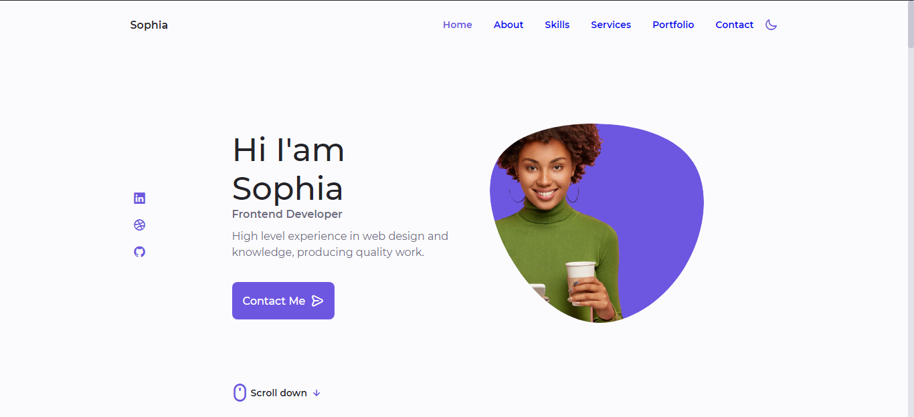

<h1 align="center">Portfólio Sophia</h1>

    

## 💻 Projeto

Site pessoal desenvolvido para apresentar os trabalhos, habilidades e trajetória profissional da designer/desenvolvedora fictícia Sophia. O projeto tem foco em identidade visual, layout responsivo e navegação fluida, servindo como vitrine digital com seções como "Sobre mim", "Projetos", "Serviços" e "Contato".

## ✨ Tecnologias

    
    
    

 

---

Feito com ❤ por Aiandra Meira 👋🏻 &nbsp;[Portfólio Pessoal](https://aiandralves.com.br)
